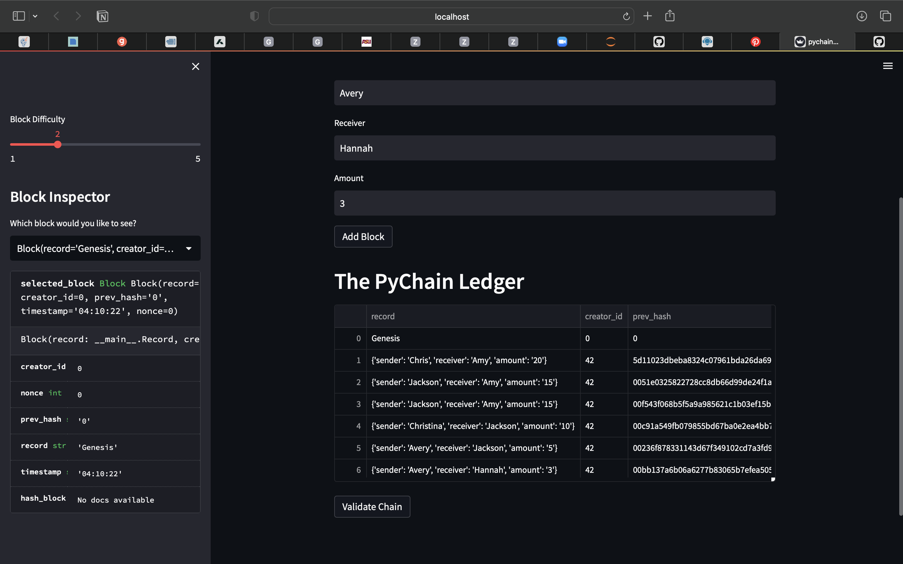
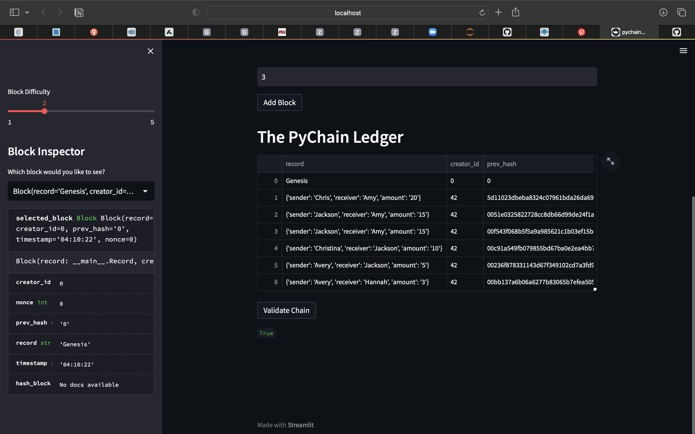

# Pychain_Ledger

## Instructions

* 1. Create a new data class named `Record`. This class will serve as the blueprint for
* the financial transaction records that the blocks of the ledger will store.

* 2. Modify the existing `Block` data class to store `Record` data.

* 3. Add Relevant User Inputs to the Streamlit interface.

* 4. Test the PyChain Ledger by Storing Records.

### Step 1: New data class named `Record`
@dataclass
class Record:
    sender: str
    receiver: str
    amount: float
    
### Step 2: Modify existing `Block` data class to store `Record` data 
@dataclass
class Block:
    record: Record
    
### Step 3: Add Relevant User Inputs to the Streamlit interface
* sender = st.text_input("Sender")
  
* receiver = st.text_input("Receiver")
  
* amount = st.text_input("Amount")

### Step 4: Test the PyChain Ledger by Storing Records

### Add Block

### Validate Chain

